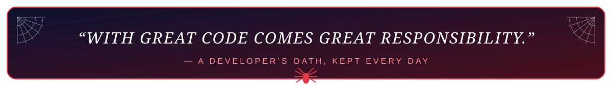

 

---

## 🕷️ About Me

**Every hero has an origin story.** Mine started with a web browser, a curiosity for how things work, and an unhealthy amount of coffee. Today I swing between the backend, the frontend, and everything in between — weaving AI into products people actually use.

- 🕸️ **Web-Slinger of Code** — Full-stack developer crafting end-to-end products (AI/ML • Backend • Frontend • System Design • Automation)
- 🧠 **AI Product Engineer** — Building intelligent, cloud-native products, not just projects
- 🎓 **Builder at heart** — From real-time negotiation platforms to AI math video editors, I love turning crazy ideas into shipped software
- 🌱 **Always learning** — New frameworks, new algorithms, new ways to make the web faster and smarter
- 💡 **Motto:** *"Building products, not just projects."*

## 🧪 The Lab — Tech Arsenal

Every hero needs the right gadgets. Here's my web-shooter toolkit:

  
   
  
   
  

## 📊 Web-Shooter Stats

  
  

  
  

## 📈 Contribution Signals — Spider-Sense

  

## 🏅 Command Center — Live GitHub Dashboard

> This dashboard is **auto-generated every day** from the GitHub API by a scheduled workflow — followers, activity, languages, achievements and more.

  

## 🚀 Mission Log — Featured Projects

| | |
|:---:|:---:|
| **🧠 LearnFlow** AI-powered personalized learning with intelligent content generation & multi-platform publishing. `Python` `AI` `Cloud-native`   | **🛒 Multilingual_Mandi** Real-time multilingual negotiation platform with instant translation, AI price discovery & live chat. `TypeScript` `Firebase` `WebSockets`   |
| **✍️ HandFree** Real-time webcam air-writing system — MediaPipe hand tracking + Kalman filtering + hybrid CNN. `Python` `OpenCV` `MediaPipe` `CNN`   | **🎬 LineX** Manim-powered AI video editor for math — generate pro animations from prompts & shapes. `Python` `Manim` `AI`   |
| **🧮 MathMax2K25** Adaptive math learning with personalized practice, real-time multiplayer challenges & dashboards. `JavaScript` `Full-stack`   | **🎨 portfolio-template** Premium dark-themed portfolio built with React & Tailwind — elegant animations, gold-accented design system. `React` `Tailwind` `HTML`   |

## ⚡ Recent Activity — Live Feed

> Updated automatically every few hours by a GitHub Action.

<!--RECENT_ACTIVITY:last_update-->
Last Updated: Thursday, August 6th, 2026, 8:55:30 PM
<!--RECENT_ACTIVITY:last_update_end-->

<!--RECENT_ACTIVITY:start-->
1. ⬆️ Pushed undefined commit(s) to [incogvia-tech/incogvia-portfolio](https://github.com/incogvia-tech/incogvia-portfolio) 
2. ⬆️ Pushed undefined commit(s) to [incogvia-tech/incogvia-portfolio](https://github.com/incogvia-tech/incogvia-portfolio) 
3. ⬆️ Pushed undefined commit(s) to [incogvia-tech/incogvia-portfolio](https://github.com/incogvia-tech/incogvia-portfolio) 
4. ⬆️ Pushed undefined commit(s) to [Potri2357/EagleOrDuck](https://github.com/Potri2357/EagleOrDuck) 
5. ⬆️ Pushed undefined commit(s) to [Potri2357/EagleOrDuck](https://github.com/Potri2357/EagleOrDuck) 
6. ⬆️ Pushed undefined commit(s) to [Potri2357/EagleOrDuck](https://github.com/Potri2357/EagleOrDuck) 
7. ⬆️ Pushed undefined commit(s) to [Potri2357/EagleOrDuck](https://github.com/Potri2357/EagleOrDuck) 
8. ⬆️ Pushed undefined commit(s) to [Potri2357/EagleOrDuck](https://github.com/Potri2357/EagleOrDuck) 
<!--RECENT_ACTIVITY:end-->

## 🐍 The Web-Crawler — Contribution Snake

> This snake eats your contributions and grows — regenerated **every day** by a scheduled workflow.

  

## 📬 Connect With Me

  
  
  

  🕷️ Crafted with great power by <b>Potrinathan P M</b> · This README auto-updates via GitHub Actions & live GitHub APIs

  

